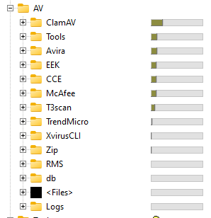

# MultiAV-CLS: Multiple AntiVirus - Command Line Scanner

MultiAV-CLS is an open-source command line scanner written in python that allows users to scan files and detect malware using multiple antivirus engines. It is designed to be lightweight, fast, portable, and easy to use.

### Features
- Scan one or more files at a time, or an entire directory
- Scan for malware with multiple antivirus engines
- Update virus definitions
- Fully portable
- Ability to parse logs to compare how much malwares was detected by each scanner
- Uses engines from Avira, McAfee, ClamAV, Emsisoft, Ikarus, MS Defender, TrendMicro, and Rose Malware Scanner. Will add more engines in the future
- All engines virus definitions can be updated to the latest version except for TrendMicro and RMS, which I will be updating their update process in future updates for the script

### Requirements:

- import os
- import subprocess
- import shutil
- import zipfile
- import requests
- import re
- import hashlib

Follow the directory structure in this sample, or you can modify the script to use your own directory structure

### AV Scanner Supported 
All this scanners are portable except MS Defender, which is builtin to Windows

#### Avira 
Download the Avira ScanCL from here http://professional.avira-update.com/package/scancl/win32/en/scancl-win32.zip and extract the file to {root}\Avira\ where root is where the MultiAV-CLS.py is located. Download the Avira Fusebundle from here http://professional.avira-update.com/package/scancl/win32/en/scancl-win32.zip and extract to folder {root}\Avira\Fusebundle\

#### McAfee

Download online, extract to {root}\McAfee\

#### ClamAV

Download @ https://www.clamav.net/downloads, select the clamav-1.0.0.win.x64.zip, extract to {root}\ClamAV\

#### Emsisoft Emergency Kit

Download here https://www.emsisoft.com/en/home/emergency-kit/, Install to {root}\EEK\

#### Ikarus t3scan

Download here http://updates.ikarus.at/updates/update.htm, extract to {root}\T3scan\

#### Microsoft Defender

Already included with Windows 10/11, executable located at "c:\Program Files\Windows Defender\MpCmdRun.exe"

#### RMS - Rose Malware Scanner

Download at http://rose.rult.at/, extract to RMS folder at {root}\RMS\

